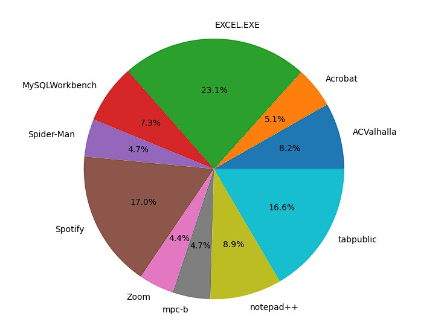
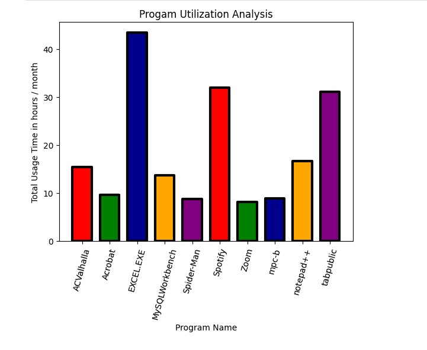

# Program Utilization Monitor
This program monitors the usage of specified programs and creates a CSV log for each program.

This is a Python program that monitors the usage of specified programs on a computer and saves the data in a CSV file. The CSV files are saved in a folder named "Log of CSVs" in the same directory as the script.

The program requires a "monitored_programs.txt" file to be present in the same directory as the script. This text file contains a list of programs that the user wants to monitor, with the file path to each program on a separate line. The program names and their corresponding folder names (versions) are extracted from the file and stored in separate lists.

The program uses the psutil library to get a list of all running processes on the computer. It then iterates through each process to check if any of the monitored programs are running. If a monitored program is running, the program retrieves information about it, such as the time it started running, and the amount of time it has been running for. This information is then stored in a Pandas DataFrame.

If a CSV file already exists for the monitored program, the program compares the last entry in the file with the current program session to check if it is the same session or a new session. If it is a new session, the program creates a new row in the CSV file for that session.

The program also contains a function to combine all the separate CSV files into a single "combined.csv" file, which is also saved in the "Log of CSVs" folder.

 Here's how to use the program:

### Installation
1. Extract the dist file from the RAR file.
2. Run Program Utilization Monitor.exe. It may take up to 10 seconds to load for the first time.
3. Find the path to the program you want to monitor. You can use Shift + right-click on the program's executable and select Copy as path from the menu.
4. Open the monitored_programs.txt file and paste the path of the program on a single line. Repeat this step for each program you want to monitor. 

For example:

"C:\Users\Soni\AppData\Local\Programs\Microsoft VS Code\Code.exe"

"C:\Users\Soni\AppData\Roaming\Spotify\Spotify.exe"

"C:\Program Files\MicrosoftOffice\root\Office16\EXCEL.EXE"

"C:\Assassins Creed Valhalla\ACValhalla.exe"

The program will create a CSV log for each monitored program in the Log of CSVs folder.

Keep the script running to continue monitoring the programs in real-time.

### New Improvements:

The program will no longer crash if a monitored process stops or isn't running.

Data is no longer lost when the computer is rebooted.

The script's CPU usage has been reduced from 28% to less than 5%.

The formatting of columns and cell values has been improved for easier tracking in Excel.

### Known Issues:

The program cannot write to the CSV log if it's open in Word or Excel. Use VSCode instead to view the data while the script is running.

If a program runs multiple instances at the same time i.e. (Google Chrome), it adds duplicate values in it's CSV. I am looking for a solution for this bug.

### Programs_Time_Analyzer jupyter notebook

I have created a Jupyter Notebook that analyzes the data in combined.csv and generates a pie chart and a bar chart. The pie chart displays the percentage of time spent on each program over the total period, while the bar chart displays the total utilization time for each program.

By analyzing these charts, we can identify the user's most preferred programs throughout the day. The data in the screenshot used for this analysis was collected from my own usage during the period between March 15th and April 15th.

The analysis can be easily applied to other datasets to gain insights into user behavior and preferences. The Jupyter Notebook includes detailed instructions and code to reproduce the analysis, making it easy for others to replicate the results.

